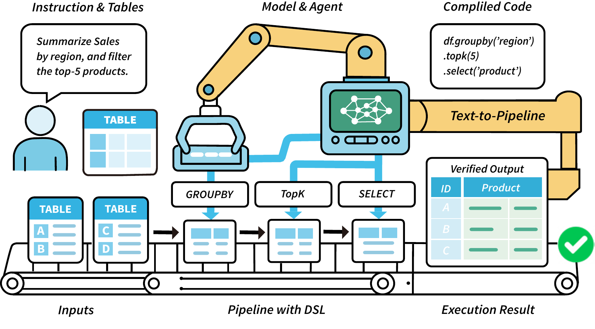

# Text-to-Pipeline: Bridging Natural Language and Data Preparation Pipelines

This repository is the official implementation of "**Text-to-Pipeline: Bridging Natural Language and Data Preparation Pipelines**"

  Data preparation (DP) transforms raw data into a form suitable for downstream applications, typically by composing operations into executable pipelines.  Building such pipelines is time-consuming and requires sophisticated programming skills. If we can build the pipelines with natural language (NL), the technical barrier of DP will be significantly reduced. However, constructing DP pipelines from NL instructions remains underexplored. To fill the gap, we introduce **Text-to-Pipeline**, a new task that translates NL data preparation instructions into DP pipelines. Furthermore, we develop a benchmark named **PARROT** to support systematic evaluation. To simulate realistic DP scenarios, we mined transformation patterns from production pipelines and instantiated them on 23,009 real-world tables collected from six public sources. The resulting benchmark comprises ~18,000 pipelines covering 16 core DP operators. We evaluated cutting-edge large language models on **PARROT** and observed that they only solved 72.86\% of the cases, revealing notable limitations in instruction understanding and multi-step reasoning. To address this, we propose **Pipeline-Agent**, a stronger baseline that iteratively predicts and executes operations with intermediate table feedback, achieving the best performance of 76.17\%. Despite this improvement, there remains substantial room for progress on **Text-to-Pipeline**. Our data, codes, and evaluation tools are available at [https://anonymous.4open.science/r/Text-to-Pipeline](https://anonymous.4open.science/r/Text-to-Pipeline).

---

## Framework Architecture

The overall architecture of the framework is illustrated below:



A high-resolution version is available for download [here](figures/workflow.png).

---

## Overview

### 📦 Dataset Description: PARROT

**PARROT** is a large-scale benchmark designed to evaluate the ability of language models to synthesize multi-step, executable data preparation pipelines from natural language instructions.

Each instance in the dataset is a 5-tuple:

```
(input_table, instruction, DSL program, executable_code, output_table)
```

- `input_table`: A real-world table sampled from diverse domains.
- `instruction`: A natural language description of the desired transformation.
- `DSL program`: A symbolic DSL representing the multi-step pipeline.
- `executable_code`: Compiled Python (Pandas) or SQL code.
- `output_table`: The expected result of executing the pipeline.

#### ✅ Key Features

- **Realistic**: Instructions are generated over real tables sourced from public datasets and forums.
- **Executable**: All programs are validated by executing the code and verifying output correctness.
- **Multi-step**: Pipelines include complex sequences such as `filter → groupby → sort → rename`.
- **Multi-backend**: Supports DSL, Pandas code, and can also extend to SQL or Spark (via modular compiler backend).
- **Diverse**: Covers 16 core data preparation operators (e.g., `pivot`, `explode`, `join`, `dropna`, etc.).

#### 🔗 Dataset Structure

The dataset is split into `train/`, `dev/`, and `test/` directories, each containing:

- `benchmark.jsonl`: Metadata including task descriptions, instructions, intents, and transformation chains.
- `csv_files.zip`: Compressed file containing serialized input and target tables for all tasks in CSV format.

#### 📖 Use Cases

- Text-to-Pipeline generation
- Semantic parsing for data pipelines
- Benchmarking LLMs on structured data preparation
- Agent-based data management

### Key Experimental Results

| **Model**                          | **Execution Accuracy (EA)** |            |            |            | **Program Validity (PV)** |            |            |            | **Operator Accuracy (OA)** |            |            |            |
| :--------------------------------- | :-------------------------: | :--------: | :--------: | :--------: | :-----------------------: | :--------: | :--------: | :--------: | :------------------------: | :--------: | :--------: | :--------: |
|                                    | Easy                        | Medium     | Hard       | Overall    | Easy                      | Medium     | Hard       | Overall    | Easy                       | Medium     | Hard       | Overall    |
| **Zero-shot LLMs (non-reasoning)** |                             |            |            |            |                           |            |            |            |                            |            |            |            |
| GPT-4o-mini                        | 75\.17                      | 59\.55     | 49\.79     | 62\.88     | 87\.92                    | 73\.83     | 62\.34     | 76\.38     | 67\.08                     | 70\.44     | 69\.6      | 69\.22     |
| GPT-4o                             | **89\.03**                  | **79\.06** | **72\.38** | **71\.00** | 89\.04                    | **79\.07** | **72\.38** | **81\.12** | 64\.24                     | **70\.7**  | **74\.44** | **69\.27** |
| Gemini-2\.5-Pro                    | 80\.09                      | 62\.09     | 52\.72     | 66\.26     | **91\.5**                 | 77\.65     | 67\.78     | 80\.4      | **68\.75**                 | 64\.54     | 67\.72     | 66\.95     |
| DeepSeek-V3                        | 78\.52                      | 63\.79     | 56\.07     | 67\.19     | 89\.49                    | 77\.09     | 68\.62     | 67\.31     | 66\.7                      | 68\.32     | 72\.62     | 68\.54     |
| **Zero-shot LLMs (reasoning)**     |                             |            |            |            |                           |            |            |            |                            |            |            |            |
| GPT-o3-mini                        | **82\.1**                   | 68\.88     | **67\.36** | **72\.86** | 92\.39                    | 81\.47     | 79\.92     | 84\.7      | **67\.86**                 | **70\.51** | **72**     | **69\.91** |
| GPT-o4-mini                        | 81\.87                      | **69\.17** | 64\.02     | 72\.36     | **94\.85**                | **83\.31** | **82\.01** | **86\.79** | 64\.47                     | 68\.76     | 68\.61     | 67\.36     |
| DeepSeek-R1                        | 77\.18                      | 58\.84     | 41\.84     | 61\.81     | 89\.49                    | 72\.7      | 55\.23     | 75\.09     | 67\.45                     | 68\.06     | 67\.39     | 67\.75     |
| **Fine-tuned LLMs**                |                             |            |            |            |                           |            |            |            |                            |            |            |            |
| Qwen2\.5-Coder-1.5B                | 67\.79                      | 59\.41     | 50\.63     | 60\.59     | 77\.85                    | 70\.58     | 64\.02     | 71\.79     | 67\.11                     | 70\.33     | 66\.55     | 68\.65     |
| Qwen2\.5-Coder-3B                  | 83\.67                      | 69\.73     | **68\.62** | 74\.01     | **91\.05**                | 80\.91     | **82\.01** | 84\.35     | 82\.03                     | 81\.76     | **81\.93** | 81\.87     |
| Qwen2\.5-Coder-7B                  | **84\.12**                  | **69\.87** | 68\.20     | **74\.15** | 91\.5                     | **82\.18** | 81\.59     | **85\.07** | **82\.96**                 | **82\.96** | 81\.59     | **82\.53** |


| **Model**          | **Execution Accuracy (EA)** |            |            |            | ****Program Validity (PV)**** |            |            |            | **Operator Accuracy (OA)** |            |            |            |
| :----------------- | :-------------------------: | :--------: | :--------: | :--------: | :---------------------------: | :--------: | :--------: | :--------: | :------------------------: | :--------: | :--------: | :--------: |
|                    | Easy                        | Medium     | Hard       | Overall    | Easy                          | Medium     | Hard       | Overall    | Easy                       | Medium     | Hard       | Overall    |
| Tool Calling       | **71\.62**                  | 58\.36     | 47\.67     | 60\.48     | 86\.48                        | 66\.53     | 58\.13     | 71\.07     | 67\.79                     | 47\.15     | 35\.4      | 51\.31     |
| Plan-and-Solving   | 63\.69                      | 43\.19     | 30\.23     | 47\.4      | 74\.52                        | 52\.53     | 38\.37     | 57         | 61\.04                     | 42\.83     | 30\.09     | 46\.36     |
| Chain-of-Tables    | 50\.67                      | 17\.9      | 9\.3       | 26\.27     | 81\.76                        | 74\.32     | 79\.07     | 77\.39     | -                          | -          | -          | -          |
| **Pipeline-Agent** |                             |            |            |            |                               |            |            |            |                            |            |            |            |
|     - GPT-4o-mini  | 70\.27                      | 61\.08     | 54\.65     | 62\.72     | 88\.51                        | 76\.26     | 67\.44     | 78\.41     | 67\.56                     | 52\.04     | 41\.02     | 54\.79     |
|     - GPT-4o       | 77\.70                      | **78\.21** | **67\.44** | **76\.17** | 96\.62                        | **88\.33** | **82\.56** | **89\.82** | **78\.04**                 | **72\.32** | **65\.91** | **72\.92** |
|     - Deepseek-V3  | 66\.89                      | 60\.7      | 48\.84     | 60\.49     | **91\.21**                    | 78\.99     | 70\.93     | 81\.26     | 68\.47                     | 58\.18     | 47\.53     | 59\.42     |

### Dataset Access

The dataset is publicly available on Hugging Face:

[**PARROT Dataset**](https://huggingface.co/datasets/momo006/PARROT)

---

## Requirements

To install requirements:

```setup
pip install -r requirements.txt
```

## Quickstart

To quickly set up and run the benchmark, follow the steps below:

### Installation

Clone the repository and install the required dependencies:

```bash
git clone https://github.com/A11en0/Text-to-Pipeline-Benchmark.git
cd Text-to-Pipeline-Benchmark
pip install -r requirements.txt
```

Alternatively, you can set up the environment using the provided YAML file:

```bash
conda env create -f environment.yml
conda activate PARROT
```

### Dataset Preparation

Navigate to the `datas` directory and run the `data.py` script to prepare the dataset:

```bash
cd datas
python data.py
```

**Before running any scripts, please set the `PYTHONPATH` to the project root directory:**

```bash
export PYTHONPATH=$(pwd)
```
---

### Generating the Benchmark (Optional)

> **Note:** The benchmark data is not included in this repository. Please download the dataset from the [Hugging Face link above](https://huggingface.co/datasets/momo006/PARROT) if needed. Normally, you do not need to run the following command unless you want to regenerate or customize the benchmark.


To generate the benchmark:

```bash
python -m src.main --config config/default_config.yaml --n_tasks 50 --complexity 8
```

---

### Baseline Models

The following commands can be used to run each baseline model:

#### 1. Chain-of-Tables

```bash
python src/baseline/chain_of_tables/run_reasoning.py --benchmark_subdir test --model gpt-4o-mini --api_key <YOUR_API_KEY>
```

#### 2. GPT-Agent

```bash
python src/baseline/gpt_agent/run_agent.py --model gpt-4o --data_dir datas/test --num_tasks 10 --api_key <YOUR_API_KEY>
```

#### 3. LLM Prompt Reasoning

```bash
python src/baseline/llm_prompt/reasoning.py --benchmark_subdir test --models gpt-4o
```

#### 4. NL2Pandas

```bash
python src/baseline/nl2pandas/run_pandas.py --model gpt-4o-mini --data_dir datas/test
```

#### 5. NL2SQL

```bash
bash src/baseline/nl2sql/run.sh
```

---

## License

This project is licensed under the MIT License - see the [LICENSE](LICENSE) file for details.

---

## Citation

If you use this benchmark or dataset in your research, please cite the following work:

```bibtex
@article{paper_citation_key,
  title={Text-to-Pipeline: Bridging Natural Language and Data Preparation Pipelines},
  author={Author Name and Collaborators},
  journal={Journal Name},
  year={2025},
  volume={XX},
  number={YY},
  pages={ZZZ},
  publisher={Publisher Name}
}
```
---